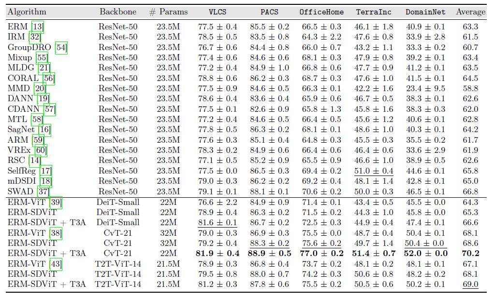

# Self-Distilled Vision Transformer for Domain Generalization (ACCV'22 -- Oral)
[Maryam Sultana](https://scholar.google.com/citations?user=dKsfEyIAAAAJ&hl=en), [Muzammal Naseer](https://scholar.google.ch/citations?user=tM9xKA8AAAAJ&hl=en), [Muhammad Haris Khan](https://scholar.google.com/citations?user=ZgERfFwAAAAJ&hl=en), [Salman Khan](https://scholar.google.com/citations?user=M59O9lkAAAAJ&hl=en), and [Fahad Shahbaz Khan](https://scholar.google.ch/citations?user=zvaeYnUAAAAJ&hl=en&oi=ao)

[](https://openaccess.thecvf.com/content/ACCV2022/html/Sultana_Self-Distilled_Vision_Transformer_for_Domain_Generalization_ACCV_2022_paper.html)
> **Abstract:** *In the recent past, several domain generalization (DG) methods have been proposed, showing encouraging performance, however, almost all of them build on convolutional neural networks (CNNs). There is little to no progress on studying the DG performance of vision transformers (ViTs), which are challenging the supremacy of CNNs on standard benchmarks, often built on i.i.d assumption. This renders the real-world deployment of ViTs doubtful. In this paper, we attempt to explore ViTs towards addressing the DG problem. Similar to CNNs, ViTs also struggle in out-of-distribution scenarios and the main culprit is overfitting to source domains. Inspired by the modular architecture of ViTs, we propose a simple DG approach for ViTs, coined as self-distillation for ViTs. It reduces the overfitting of source domains by easing the learning of input-output mapping problem through curating non-zero entropy supervisory signals for intermediate transformer blocks. Further, it does not introduce any new parameters and can be seamlessly plugged into the modular composition of different ViTs. We empirically demonstrate notable performance gains with different DG baselines and various ViT backbones in five challenging datasets. Moreover, we report favorable performance against recent state-of-the-art DG methods. Our code along with pre-trained models are made available publicly.*


## State-of-the-Art Vision Transformers for Domain Generalization
**PACS**
* `CvT-21` -   88.9 ± 0.5 @ 224
* `DeiT-Small` - 86.7 ± 0.2 @224
* `T2T-ViT-14` -  87.8 ± 0.6 @224
<hr>

**VLCS**
* `CvT-21` -  81.9 ± 0.4 @ 224
* `DeiT-Small` - 81.6 ± 0.1 @224
* `T2T-ViT-14` - 81.2 ± 0.3 @224
<hr>

**OfficeHome**
* `CvT-21` -  77.0 ± 0.2 @ 224
* `DeiT-Small` - 72.5 ± 0.3 @224
* `T2T-ViT-14` - 75.5 ± 0.2 @224
<hr>

**TerraIncognita**
* `CvT-21` -  51.4 ± 0.7 @ 224
* `DeiT-Small` - 44.9 ± 0.4 @224
* `T2T-ViT-14` - 50.5 ± 0.6 @224
<hr>

**DomainNet**
* `CvT-21` -  52.0 ± 0.0 @ 224
* `Deit-Small` - 47.4 ± 0.1 @224
* `T2T-ViT-14` - 50.2 ± 0.1 @224
<hr>

## Citation
If you find our work useful. Please consider giving a star :star: and a citation.
```bibtex
@InProceedings{Sultana_2022_ACCV,
    author    = {Sultana, Maryam and Naseer, Muzammal and Khan, Muhammad Haris and Khan, Salman and Khan, Fahad Shahbaz},
    title     = {Self-Distilled Vision Transformer for Domain Generalization},
    booktitle = {Proceedings of the Asian Conference on Computer Vision (ACCV)},
    month     = {December},
    year      = {2022},
    pages     = {3068-3085}
}
```

### Contents  
1) [Highlights](#Highlights) 
2) [Installation](#Installation)
3) [Datasets](#Datasets)
4) [Training Self-Distilled Vision Transformer](#Training-Self-Distilled-Vision-Transformer)
5) [Pretrained Models](#Pretrained-Models)
5) [Evaluating for Domain Generalization](#Evaluating-for-Domain-Generalization)
6) [Attention Visualizations](#Attention-Visualizations)


### Highlights
- Inspired by the modular architecture of ViTs, we propose a light-weight plug-and-play DG approach for ViTs, namely self-distillation for ViT (SDViT). It explicitly encourages the model towards learning generalizable, comprehensive features.
- We show that by improving the intermediate blocks, which are essentially multiple feature pathways, through soft supervision from final classifier facilitates the model towards learning crossdomain generalizable features. Our approach naturally fits into the modular and compositional architecture of different ViTs, and does not introduce any new parameters. As such it adds a minimal training overhead over the baseline.
<p align="center">
      
</p>
In the Fig. above, we plot the block-wise accuracy of baseline (ERM-ViT) and our method (ERM-SDViT). Random sub-model distillation improves the accuracy of all blocks, in particular, the improvement is more pronounced for the earlier blocks. Besides later blocks, it also encourages earlier blocks to bank on transferable representations, yet discriminative representations. Since these earlier blocks manifest multiple discriminative feature pathways, we believe that they better facilitate the overall model towards capturing the semantics of the object class.


### Installation
To install conda env with conda, run the following command in your terminal:
```sh
conda env create -n ViT_DGbed --file ViT_DGbed.yml
```
Activate the conda environment:
```sh
conda activate ViT_DGbed
```
### Datasets

```sh
python3 -m domainbed.scripts.download \
       --data_dir=./domainbed/data --dataset pacs
```
Note: for downloading other datasets change --dataset pacs with other datasets (e.g., vlcs, office_home, terra_incognita, domainnet).


### Model selection criteria
We computed results on the following model selection
* `IIDAccuracySelectionMethod`: A random subset from the input data of the training source domains.

### Training Self-Distilled Vision Transformer

- Step 1: Download the pretrained models on Imagenet, such as [CVT-21](https://onedrive.live.com/?authkey=%21AMXesxbtKwsdryE&cid=56B9F9C97F261712&id=56B9F9C97F261712%2115008&parId=56B9F9C97F261712%2115004&o=OneUp), [T2T-ViT-14](https://drive.google.com/file/d/1tBWvwThlvQMBCmok-f63a6weWdwJiGr9/view?usp=sharing)
- Step 2: Place the models in the path ./domainbed/pretrained_models/Model_name/
- Step 3: Run the followng commands:  

Launching a sweep on ViT Baselines:

```sh
./Baseline_sweep.sh
```
Launching a sweep on SDViT Model:

```sh
./Grid_Search_sweep.sh
```
Note: For above all commands change --dataset PACS for training on other datasets such as OfficeHome, VLCS, TerraIncognita and DomainNet and backbone to CVTSmall or T2T14.

### Pretrained Models
Pretrained ViT models:

| Dataset   |                                               Baseline (ERM-ViT)                                              |                                                                                             Ours (ERM-SDViT) | 
|:----------|:----------------------------------------------------------------------------------------------------:|-------------------------------------------------------------------------------------------------:|
| PACS      |   [Link](https://drive.google.com/file/d/1m2_RP6nFm0uGJKyYPUIGa1ZYseV8Ak5j/view?usp=sharing)    |   [Link](https://drive.google.com/file/d/1jD8nD8b8Ki09YhOAx0mINEOYd4D3L9Gp/view?usp=sharing) | 
| VLCS | [Link](https://drive.google.com/file/d/1DaWhn5pqtEQPple59oNwfPrdtN0OBmRG/view?usp=sharing) | [Link](https://drive.google.com/file/d/1UOq-8AS_o_KhyIqHBGIaFSJkrbli9kXC/view?usp=sharing) | 
| OfficeHome    |  [Link](https://drive.google.com/file/d/1jVWSCNFAiL7MPi3vqGmcHp1QC2sBJJPr/view?usp=sharing)   |  [Link](https://drive.google.com/file/d/1r-V4HbrXscI3nQcsMA2Zo-45i7O6K8Zk/view?usp=sharing) | 
| TerraIncognita    |  [Link](https://drive.google.com/file/d/1qBuyTTw2eAvqQDrZ4pT0tSBzWqtVrE5s/view?usp=sharing)   |  [Link](https://drive.google.com/file/d/194PM4-HPgq8Udejyhfc0yX53nEpUcgXX/view?usp=sharing) | 
| DomainNet    |  [Link](https://drive.google.com/file/d/1cqZiMUXVekLCpLeVeQyRvr4JEFnfHkVs/view?usp=sharing)   |   [Link](https://drive.google.com/file/d/1X2T60Ub3cvrkqWWRvt5tlom59P-vR_zw/view?usp=sharing) | 


<hr />
<hr />

### Evaluating for Domain Generalization

To view the results using our pre-trained models:
- Step 1: Download the pretrained models uisng the links in above Table and place them dataset wise under the folder `Results'
- Step 2: Run the following command to get outputs
````sh
python -m domainbed.scripts.collect_results\
       --input_dir=/Results/Dataset/Model/Backbone/ --get_recursively True
````
Note: Replace the text with dataset and model names (e.g: Results/PACS/ERM-ViT/DeiT-Small/ and so on....) to view results on various models. Test-Time Classifier Adjuster (T3A) is exploited in our proposed method as a complimentary approach, for details please refer to following instructions:
[T3A](https://github.com/matsuolab/T3A)

**Results:**

1. Accuracy on three Backbone Networks using PACS dataset.

2. Accuracy on three Backbone Networks using five benchmark datasets in comparison with DG SOTA.


### Attention Visualizations

<p align="center">
      
</p>
Comparison of attention maps between the baseline ERM-ViT and our proposed ERM-SDViT (backbone: DeiT-Small) on four target domains of PACS dataset. 
<p align="center">
      
</p>
Comparison of attention maps between the baseline ERM-ViT and our proposed ERM-SDViT (backbone: DeiT-Small) on four target domains of VLCS and OfficeHome dataset.
<p align="center">
      
</p>
Comparison of attention maps between the baseline ERM-ViT and our proposed ERM-SDViT (backbone: DeiT-Small) on six target domains of DomainNet dataset.


### Acknowledgment
The code is build on the top of DomainBed: a PyTorch suite containing benchmark datasets and algorithms for domain generalization, as introduced in [In Search of Lost Domain Generalization](https://arxiv.org/abs/2007.01434). ViT Code is based on [T2T](https://github.com/yitu-opensource/T2T-ViT), [CVT](https://github.com/microsoft/CvT), [DeiT](https://github.com/facebookresearch/deit) repository and [TIMM](https://github.com/rwightman/pytorch-image-models) library. We thank the authors for releasing their codes.

### License

This source code is released under the MIT license, included [here](LICENSE).
